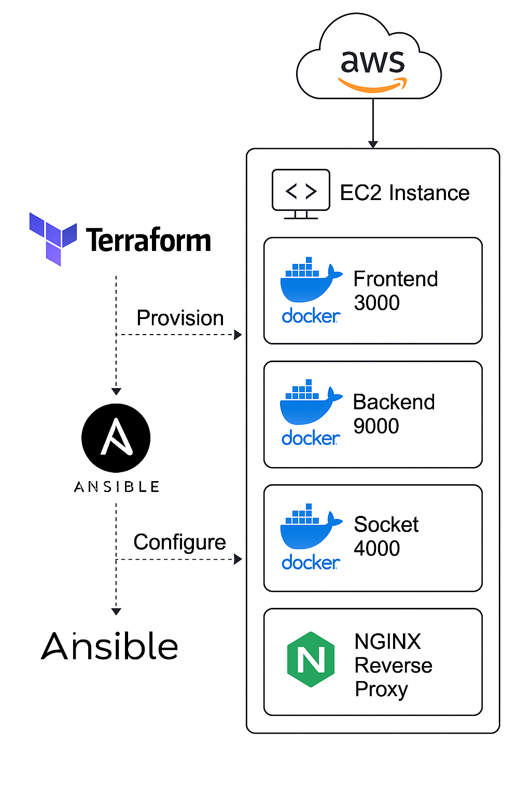

# System Requirements

**Operating System:**  
Linux (Ubuntu/Debian recommended)

**AWS Account:**  
Required for provisioning. If you don't have one, contact me for a test key.

**Software Dependencies:**  
bash, sudo, apt-get, curl or wget, gnupg / gpg, software-properties-common

**Hardware Requirements:**  
- RAM: 1 GB minimum (2 GB recommended)  
- Disk Space: 2 GB free or more  
- CPU: 1 core minimum (2+ cores recommended)  

**Network Requirements:**  
Internet access is required to download packages and repositories.

**Permissions:**  
Ability to run commands with `sudo`.


## 🚀 Project Setup

<p align="center">
  
</p>


### 1. Clone the Repository

```bash
git clone https://github.com/olvanotjeanclaude/epin-naka-infra.git
cd epin-naka-infra
```

---

### 2. Install Terraform & Ansible

```bash
sudo chmod +x setup.sh
sudo ./setup.sh
terraform --version
ansible --version
```

> 📚 [Terraform Install Docs](https://developer.hashicorp.com/terraform/tutorials/aws-get-started/install-cli)

---

### 3. Setup SSH Key

```bash
chmod +x ssh-setup.sh
./ssh-setup.sh
```

---

### 4. Configure AWS CLI

```bash
sudo apt install -y awscli
aws configure
```

Enter the following:

* **AWS Access Key ID** (paste it)
* **AWS Secret Access Key** (paste it)
* **Default region**: `eu-central-1` or just press enter
* **Output format**: `json`

---

### 5. Setup Terraform

```bash
cd terraform-aws
cp terraform.tfvars.example terraform.tfvars
```

Update `terraform.tfvars` as needed (e.g., key name, public key path).

---

### 6. Provision Infrastructure on AWS

```bash
terraform init
terraform plan
terraform apply  # Type 'yes' to confirm
```

📌 **Note the WebPublicIP** (e.g., `3.121.162.168`) – used in the next step.

---

### 7. Setup Ansible for Server Configuration & Deployment

```bash
cd ../ansible
nano hosts
```

Paste your public IP like this:

```hosts
<WebPublicIP> ansible_user=ubuntu ansible_ssh_private_key_file=~/.ssh/epinaka-key
```

Then save with `Ctrl + S` → `Ctrl + X`

Run Ansible playbook:

```bash
ansible-playbook -i hosts site.yml
```

---

## 🌐 Access the Project

| Service         | URL                        |
| --------------- | -------------------------- |
| Backend API     | http\://3.121.162.168      |
| Socket Server   | http\://3.121.162.168:4000 |
| Frontend (Next) | http\://3.121.162.168:3000 |

---

## 🪑 Tear Down / Destroy AWS Resources

```bash
terraform destroy
```
